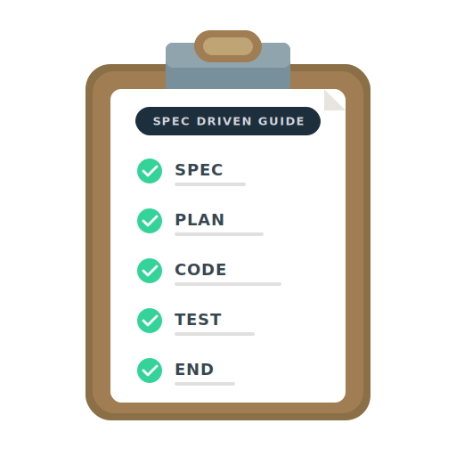

  <h1>SDG Prompts — Spec-Driven Guide</h1>

  

  

    
    
    
    
  

  

    <a href="README.md">🇺🇸 English</a> | 
    <a href="assets/README.pt-BR.md"><b>🇧🇷 Português</b></a> | 
    <a href="CHANGELOG.md"><b>📜 Changelog</b></a> | 
    <a href="https://specdrivenguide.org"><b>🌐 specdrivenguide.org</b></a>
  

Welcome to the **SDG Prompts** ecosystem. This repository contains a structured collection of prompt tracks and governance protocols designed to guide autonomous AI agents and developers through the software development lifecycle.

## 🎯 The Goal

We provide a framework where code becomes the natural result of a precise specification. By adhering to the **SDG (Spec-Driven Governance)** protocol, developers ensure that every change remains traceable, modular, and aligned with business requirements.

## 🗺️ Project Structure

This project organizes documentation and tracks into English (`docs/en/`) and Brazilian Portuguese (`docs/pt-BR/`) mirrors.

### 📜 [Guides and Manuals](docs/en/)

- [**Spec-Driven Governance Guide**](docs/en/spec-driven-dev-guide.md): Detailed manual on the 5-phase task cycle (SPEC, PLAN, CODE, TEST, END).
- [**Methodology & References**](assets/REFERENCES.md): Origins and theoretical DNA behind the SPEC pattern.

### 🏗️ [Prompt Tracks](docs/en/prompt-tracks/)

We provide three distinct tracks tailored to project maturity:

1. [**00 - Lite Mode**](docs/en/prompt-tracks/00-lite-mode/): Accelerated workflow for landing pages and MVPs (Minimum Viable Products).
2. [**01 - New Evolution**](docs/en/prompt-tracks/01-new-evolution/): Standard path for building scalable greenfield applications from scratch.
3. [**02 - Legacy Modernization**](docs/en/prompt-tracks/02-legacy-modernization/): Technical guide for refactoring and migrating brownfield (existing) systems using the Strangler Fig pattern.

<b>🧠 Anatomy of a Good SPEC (Example)</b>

# SPEC-001: Subscription Cancellation System (Self-Service)

## 1. Context

Currently, subscription cancellation is handled only via human chat, leading to high support load and customer frustration. This spec defines the automation of the cancellation flow directly through the user panel.

## 2. Success Metrics

- 40% reduction in cancellation-related support tickets.
- 10% user retention through "downgrade" offers during the flow.
- Immediate update of subscription status in the database and payment gateway.

## 3. Scope & Scenarios (User Stories)

- **Scenario A:** User cancels and loses access at the end of the paid period (pro-rata).
- **Scenario B:** User accepts a discount offer to avoid cancellation.
- **Scenario C:** User with pending invoices is prevented from cancelling via self-service.

## 4. Constraints & Business Rules

- **Eligibility:** Only "Premium" or "Standard" plan users can cancel via the panel. "Enterprise" plans require contact with the Account Manager.
- **Deadlines:** Cancellation must be requested at least 24h before the next renewal to avoid unwanted charges.
- **Reversibility:** User can reactivate the subscription with one click until the last day of the current cycle.

## 5. Out of Scope

- Automatic refunds (refunds must be manual via admin).
- Cancellation of accounts suspended for fraud.

## 6. Definition of Done

- [ ] Integration with the Stripe API to cancel renewal.
- [ ] Sending termination confirmation email.
- [ ] Cancellation reason log saved for the Product team.

 

---

## 🧠 How to use these tracks

1. **Identify Maturity**: Determine if your project is a prototype, a new build, or a legacy system.
2. **Follow the Cycle**: Each track consists of numbered Markdown files. Execute them sequentially. These files act as a state machine for your development process.
3. **Writing Soul Protocol**: All documentation follows the **Writing Soul** standard — pedagogical, calm, and direct. Use these prompts to feed your AI Agent for consistent, high-quality output.

## License

This project is licensed under the [ISC License](LICENSE).

---

_Developed for Staff Engineers and AI-Native Developers who value precision over speed._
