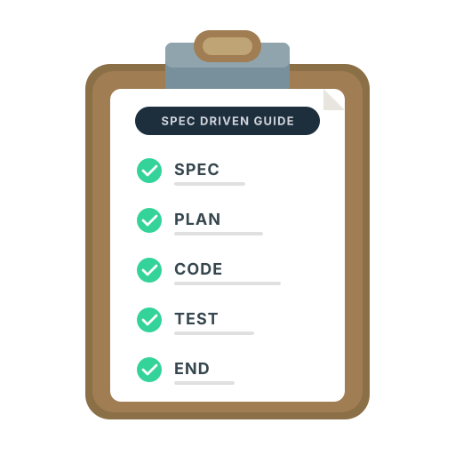

  <h1>SDG Prompts · Spec-Driven Guide</h1>

  

  

    
    
    
    
  

  

    <a href="README.md">🇺🇸 English</a> | 
    <a href="assets/README.pt-BR.md"><b>🇧🇷 Português</b></a> | 
    <a href="assets/CHANGELOG.md"><b>📜 Changelog</b></a> | 
    <a href="https://specdrivenguide.org"><b>🌐 specdrivenguide.org</b></a>
  

**SDG Prompts** is a collection of prompt tracks and governance rules for teams that work alongside AI agents. Each track is a sequence of Markdown files you feed to the agent, one phase at a time.

## 🎯 The Goal

Write the specification first, then code only what it describes. In the **SDG (Spec-Driven Governance)** protocol every task starts from a written contract, so the reason for each change stays recorded next to the code.

## 🗺️ Project Structure

Documentation and tracks exist as two mirrors: English (`docs/en/`) and Brazilian Portuguese (`docs/pt-BR/`).

### [Guides and Manuals](docs/en/)

- [**Spec-Driven Governance Guide**](docs/en/spec-driven-dev-guide.md): the 5-phase task cycle (SPEC, PLAN, CODE, TEST, END) explained step by step.
- [**Methodology & References**](assets/REFERENCES.md): where the SPEC pattern comes from and the sources behind it.

### [Prompt Tracks](docs/en/prompt-tracks/)

Three tracks, one for each level of project maturity:

1. [**00 - Lite Mode**](docs/en/prompt-tracks/00-lite-mode/): short cycle for landing pages and MVPs.
2. [**01 - New Evolution**](docs/en/prompt-tracks/01-new-evolution/): full path for a greenfield application, built from scratch.
3. [**02 - Legacy Modernization**](docs/en/prompt-tracks/02-legacy-modernization/): refactoring and migrating a brownfield system with the Strangler Fig pattern.

## 📖 Concepts

The technical terms used across the tracks, grouped by where they show up.

**The cycle:** the five phases of a task

| Concept | What it means |
| --- | --- |
| [SPEC](docs/en/spec-driven-dev-guide.md#phase-spec) | The written contract: context, metrics, scope, rules and what stays out. The agent writes no code before it exists |
| [PLAN](docs/en/spec-driven-dev-guide.md#phase-plan) | The technical strategy: which files change, in what order, and the risks involved |
| [CODE](docs/en/spec-driven-dev-guide.md#phase-code) | The execution, limited to what the PLAN described |
| [TEST](docs/en/spec-driven-dev-guide.md#phase-test) | The proof that each scenario in the SPEC behaves as written |
| [END](docs/en/spec-driven-dev-guide.md#phase-end) | The delivery: commit, documentation and closing of the task |

 

**Project maturity:** vocabulary used to pick a track

| Concept | What it means |
| --- | --- |
| MVP | Minimum Viable Product. The smallest version that already delivers value and can be tested with real users |
| Greenfield | A project with no existing code. You choose the stack and the architecture with no legacy to preserve |
| Brownfield | A system already in production. Every change lives with code, data and decisions that came before |
| Strangler Fig | Migration by replacement. The new system is built beside the old one and takes over route by route, until the old one can be shut down. No full rewrite |

 

**Specification:** the parts of a SPEC document

| Concept | What it means |
| --- | --- |
| Success Metrics | The numbers that say the delivery worked: tickets avoided, retention, response time |
| User Story | A scenario written from the user's point of view, describing action and expected outcome |
| Constraints | Business rules that limit the solution: eligibility, deadlines, permissions |
| Out of Scope | What stays out of this delivery on purpose, written down so the scope does not grow silently |
| Definition of Done | The checklist that closes the task. While an item is open, the task is not done |

 

**Governance:** how agents and documentation stay consistent

| Concept | What it means |
| --- | --- |
| Prompt Track | A numbered sequence of Markdown files. Each file is one step of the cycle, executed in order |
| AI Agent | The model that reads the prompts and produces the work: code, tests or documentation |
| Writing Soul | The writing standard of this project: pedagogical, calm and direct, with no filler |

<b>Anatomy of a Good SPEC (Example)</b>

# SPEC-001: Subscription Cancellation System (Self-Service)

## 1. Context

Currently, subscription cancellation is handled only via human chat, leading to high support load and customer frustration. This spec defines the automation of the cancellation flow directly through the user panel.

## 2. Success Metrics

- 40% reduction in cancellation-related support tickets.
- 10% user retention through "downgrade" offers during the flow.
- Immediate update of subscription status in the database and payment gateway.

## 3. Scope & Scenarios (User Stories)

- **Scenario A:** User cancels and loses access at the end of the paid period (pro-rata).
- **Scenario B:** User accepts a discount offer to avoid cancellation.
- **Scenario C:** User with pending invoices is prevented from cancelling via self-service.

## 4. Constraints & Business Rules

- **Eligibility:** Only "Premium" or "Standard" plan users can cancel via the panel. "Enterprise" plans require contact with the Account Manager.
- **Deadlines:** Cancellation must be requested at least 24h before the next renewal to avoid unwanted charges.
- **Reversibility:** User can reactivate the subscription with one click until the last day of the current cycle.

## 5. Out of Scope

- Automatic refunds (refunds must be manual via admin).
- Cancellation of accounts suspended for fraud.

## 6. Definition of Done

- [ ] Integration with the Stripe API to cancel renewal.
- [ ] Sending termination confirmation email.
- [ ] Cancellation reason log saved for the Product team.

 

---

## How to use these tracks

1. **Identify the maturity**: prototype, new build or legacy system. That choice picks the track.
2. **Follow the cycle**: run the numbered files in order. Each one leaves the project in a known state before the next begins.
3. **Keep the voice**: the prompts follow the **Writing Soul** standard. Use the same voice in your own files and the agent has one tone to copy.

## License

This project is licensed under the [ISC License](LICENSE). [**Changelog**](assets/CHANGELOG.md)

---

_Built for Staff Engineers and AI-native developers who prefer precision over speed._
